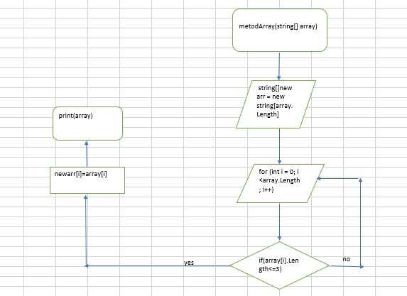

**Алгоритм решения**

*1 этап*

решаем через метод, котрый будет выполнять требуемые условия 

создаем строковый массив

*2 этап*

пишем цикл в котором будут перебираться элементы массива

*3 этап*

в тело цикла добавляем условия выборки 

*4 этап*

если есть элемент, удовлетворяющий условиям задачи, тогда создается новый массив такого же типа и в ячейку нового массива записываюся значения ячейки первичного массива

*5 этап* 

вывод массива на печать 

*6 этап*

добавили блок-схему

